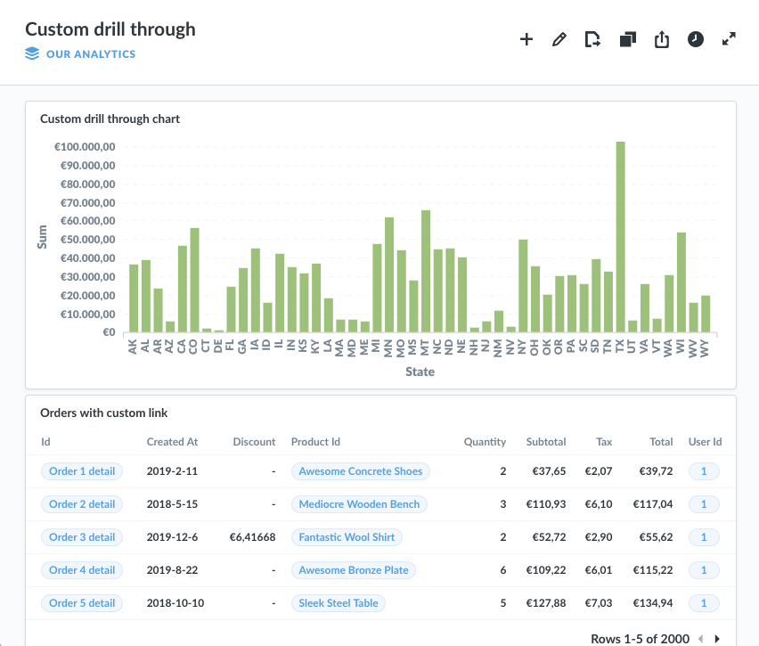
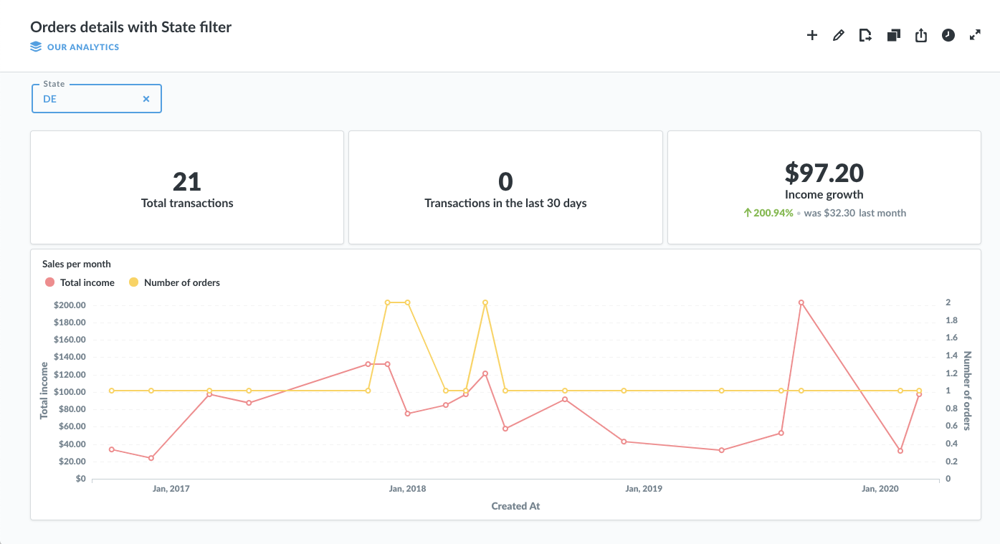
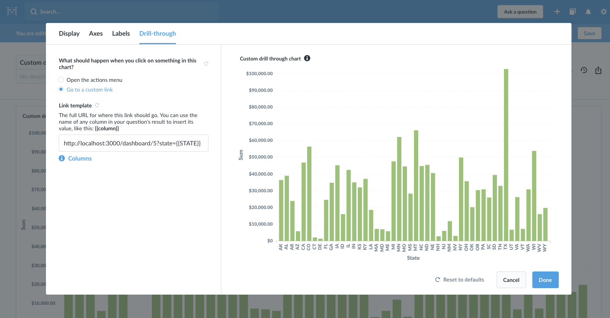
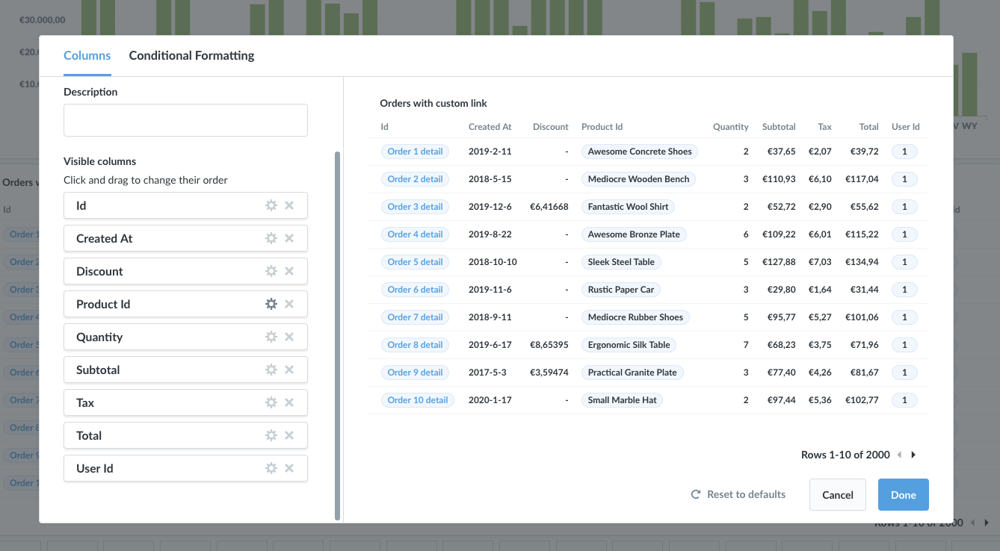
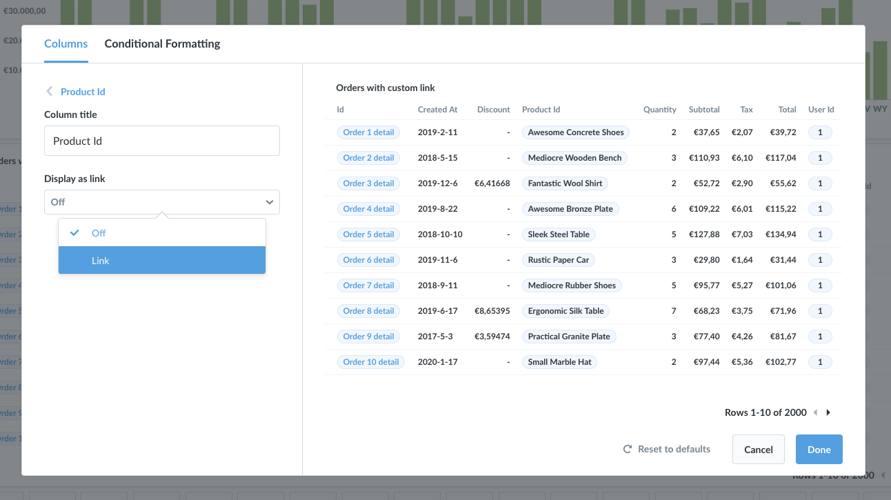

## Customizing drill-through
In the Enterprise edition of Metabase, you can change what happens when a user clicks on a part of a chart or table — i.e. what happens when they "drill through" or "drill down." This means you can make it so that clicking on a bar, point, state on a map, etc., takes the user to a custom destination instead of showing them the default Metabase drill-through menu.

Using this feature, you could for example embed a very high-level overview dashboard on the main Analytics page of your web app, and customize the drill-through behavior of each of the charts in that dashboard to have them link to other dashboards, perhaps with more detailed information about that particular subject or metric. You could also have your charts link off to other sections of your web app, or to another page entirely.

We’ll walk through how to do both of these things, first for a chart, then for a table. Here’s the chart and table we’ll be using in our examples.

### Customizing drill-through for a chart
To start, we’ll need a chart that's either in a dashboard or that's standalone. Our example chart is in a dashboard, and it displays the sum of revenue received from orders in each state of the US (it looks like Texas really loves Widgets and Gizmos).

Next, we’ll enter edit mode for our dashboard, then click the gear icon on our chart to open up the chart settings. If you’re using a standalone saved question, just click the gear next to the chart type to open up the chart settings.

Click on the `Drill-through` tab at the top and you’ll see two options for what should happen when someone clicks on this chart. The default is that it’ll open up the actions menu, but we want to override this with a custom link, so we’ll click that option. When we do, we see a new Link Template section.

What we need to do here is to type in the full URL of where a user should go when they click on a bar in the chart. But the really powerful thing we can do is to use a variable in the URL which can insert the value of the clicked bar. For example, we could type a URL like this `https://www.google.com/search?q={{STATE}}`.

The important part is the `{{STATE}}` bit — what we’re doing here is referring to the `STATE` column in our query’s result (which we’re using for our x-axis in this case). So if a user was to click on the `TX` (Texas) bar in our chart, the value of the `STATE` column for that bar would be inserted into our URL, so it would look like this: `https://www.google.com/search?q=TX`. If you click on the blue `Columns` link below the input box here, you’ll see the full list of all the columns you can refer to. Your URL can use as many column variables you want; you can even refer to the same column multiple times in different parts of the URL.

Next we’ll click `Done`, then save our dashboard. Now when we click our chart, instead of seeing the actions menu, we’ll be taken to the URL that we entered above, with the value of the clicked bar inserted into the URL. These links will be opened in a new tab or window unless they link to another chart or dashboard within Metabase.

*Note:* One important thing to point out is that when we customize drill-through on a dashboard card, rather than on the standalone saved question, we’re only customizing that instance of the chart on that one dashboard.

### Linking to another Metabase dashboard or saved question

Now that you know how to create a custom link with variables, let's talk about how to use that to link to another dashboard or saved question in your Metabase instance.

Continuing with our example chart from above, let's say that we have another dashboard with lots more in-depth information and metrics about orders for all states. In order to filter all the charts in our dashboard by a single state, we've added a `Location` type filter which has been set to let us filter by State, so we can e.g. select `Delaware` from it to make all of the charts only show Delawarean data.

What's really cool now is that we can use a custom link on the bar chart in our first dashboard to automatically pick a value for the State filter in our detail dashboard based on which bar is clicked. To do that, we'll go back to the chart on our first dashboard and go to the `Drill-through` tab in its settings.

In the Link Template input box, we'll put in the full URL of the dashboard that we want to link to, with a variable in it to populate the dashboard's filter. Dashboard URLs in Metabase look like this: `http://YOUR-METABASE-LOCATION.com/dashboard/5`. When you make a selection for a filter on a dashboard, you'll notice some additional text gets added to the end of the URL, like this: `http://YOUR-METABASE-LOCATION.com/dashboard/5?state=DE` In this example, `state` is the name of a filter on our dashboard, and `DE` is the current value of the filter (DE for Delaware). So in our input box, we're going to enter a template that looks like that, but with our `{{STATE}}` column variable in the spot where the filter's value goes: `http://YOUR-METABASE-LOCATION.com/dashboard/5?state={{STATE}}`. Once we save our changes, whenever someone clicks on a bar in this chart, it will take them to our second dashboard with the State filter on that dashboard filled in with the State value of the bar that was clicked.

Keep in mind that your link needs to use the name you've given to the filter, but with underscores in place of any spaces. So if your filter is called `Customer Name`, the part after the question mark in your link should look like `customer_name={{COLUMN}}`.

If you want to link to a saved SQL question that has filter widgets in it, you'll follow the exact same process as for a dashboard. Your link template will just look more like this: `http://YOUR-METABASE-LOCATION.com/question/17?filter={{COLUMN}}`. You can also have your link templates go to saved questions built with the graphical editor, but you can't currently pass any variable values to them to fill filters.

When you do this, it's possible you don't want the filled-in filter to be displayed on the dashboard or question, either because you don't want users to modify it directly, or maybe for aesthetic presentation reasons. If you want to hide the specified filter, use the following syntax in your custom drill-through link: [FIX ME]

### Customizing drill-through for a column in a table

Customizing drill-through for a table is very similar to doing it for a chart. Usually what we’re trying to do with a table though is to make it so that clicking on a cell in a specific column will go to a custom destination. E.g., we might have a `Product ID` column, and we’d like to make it so that clicking on a specific product's ID will open up our product catalog web app to the page that has details for the product we clicked on.

Again, in our example our table visualization is in a dashboard, so we’ll start by entering edit mode for our dashboard and then clicking the settings gear button on our table. If you were doing this on a standalone question, you’d click the gear button next to the visualization dropdown.

From the `Columns` tab we'll find the `Product ID` column and click the gear next to it.

Then we'll find the `Display as link` setting. This dropdown will be slightly different depending on what kind of column you're customizing; for example, Email or URL columns will have additional options for how they should be displayed in the table. For our purposes, we'll open the dropdown and select the `Link` option.

We'll now see the same link template input box as with the chart example above. Just as before, we can use the double braces syntax, like `{{PRODUCT_ID}}`, in our URL to refer to a column name to insert the clicked cell's value at that point in the URL.

**Referencing multiple column values**

Note that you can refer to *any* column in the table here, not just the column whose drill-through behavior you're customizing. When you click on a cell, it will insert the value of all referenced columns *in that same row* into your URL. This could let us do things like make clicking on a product's *name* go to a custom destination, but reference the product's *ID* in the URL.

This comes in handy when linking to a dashboard or question with multiple filters: your link template could for example reference two values for two filters in the dashboard you're linking to, like this so, `http://YOUR-METABASE-LOCATION.com/dashboard/5?name={{NAME}}&id={{ID}}`, where `name` and `id` are the filters. Note the ampersand `&` between the two filters in the link; you can string together any number of filters in your link templates by putting an ampersand between them.

**Customizing link text**

You can also optionally customize what text should be displayed in each cell of this column. You can also use the double braces variable syntax here. The way we've used this in the example above is to refer to the value of our `Product ID` column in a sentence that makes it clearer what will happen when the cell is clicked. So `Look up {{PRODUCT_ID}} in our catalog` gets turned into `Look up Awesome Concrete Shoes in our catalog` in the corresponding cell.

---

## Next: customizing chart colors and branding
See how to use the [white label settings](white-labeling.md) to pick your own custom colors for charts and graphs, or for the Metabase UI.
